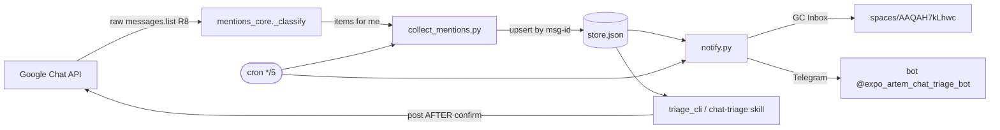

# Chat Triage Assistant — How It Works (runtime)

What the system actually does today, end to end. Companion to the plan
(`chat-triage-implementation-plan.md`) and the status journal
(`CHAT-TRIAGE-BUILD-STATUS.md`). See `TRIAGE-LIFECYCLE.md` for the item state
machine. Verified 2026-06-07.

## Purpose

Surface Google Chat messages **addressed to me** (direct messages + @mentions),
store them as an append-only triage queue, notify me out-of-band (GC Inbox space +
Telegram), and let me work the queue interactively (prioritise, draft, post replies
**only after explicit confirmation**, track open loops). Runs unattended on cron.

## Components

| Component | File | Role |
|---|---|---|
| Detection core | `mentions_core.py` (repo root) | Classifies each raw Chat message into a trigger; the single source of truth for "is this for me?" |
| Collector | `scripts/collect_mentions.py` | Headless, **read-only**. Calls the core over a time window, upserts into the store. |
| Store | `scripts/store.py` + `~/.claude-orchestrator/gchat-triage/store.json` | Atomic JSON ledger. `.items` is an **object keyed by message-id** (the dedup key). |
| Config/secrets | `scripts/config.py` + `~/.claude-orchestrator/gchat-triage/{config.json,secrets.env}` | Enable flag, cadence, quiet hours, channel toggles; secrets chmod 600. |
| Notifier | `scripts/notify.py` | Computes notification candidates, dispatches to enabled channels, records `last_notified` for dedup. Has `--dry-run`. |
| Interactive triage | `scripts/triage_session.py` (pure state) + `scripts/triage_cli.py` + skill `.claude/skills/chat-triage/SKILL.md` | Work the queue; `triage_cli post` is the **sole network writer**, gated by confirmation. |
| Scheduler | `scripts/triage_cron.sh` + `scripts/install_cron.sh` | flock-guarded `*/5` wrapper: collect -> notify. |

## Data flow



## Detection — which messages are "for me"

`mentions_core._classify(message, space_type, me)` returns a trigger or drops the message:

| Trigger | Condition | Kept? |
|---|---|---|
| `direct_dm` | any message in a `DIRECT_MESSAGE` space | yes |
| `user_mention` | `SPACE`/`GROUP_CHAT` message whose annotations `@mention` my `users/<id>` | yes |
| `broadcast` | only a room-wide `@all`/`@here` mention present | yes (fail-closed heuristic) |
| (self) | `sender == me` (`users/117216798078927891621`) | **dropped** (T1.5 filter) |
| (other) | someone else's mention / plain channel chatter | dropped |

Active policy = **Variant A**: keep `user_mention` + `direct_dm` (from others); drop my own
messages. A DM from another person IS "to me".

**ADD ≠ @mention:** a `USER_MENTION` annotation whose `userMention.type == "ADD"` is a
*membership event* (I was **added** to the space), not an @mention. `mentions_core`
skips `ADD` userMentions (`_is_real_mention`), so being added to a room no longer
mis-classifies as a `user_mention`. An absent/unspecified type is treated permissively
as a mention (forward-compatible); only `ADD` is excluded. Verified against the Chat API
`UserMentionMetadata.Type` enum, 2026-06-07.

**Why a dedicated raw fetch (R8):** `list_space_messages` strips messages to
`{sender,createTime,text,thread}` under `SAVE_TOKEN_MODE`, discarding the `annotations`
needed for mention detection. The core uses `google_chat._list_messages_sync` (raw payload).

**Identity:** `_resolve_me_sync` resolves `me` via the OAuth2 userinfo endpoint ->
`users/117216798078927891621`, matching `sender.name` in payloads.

## Store

- Path: `~/.claude-orchestrator/gchat-triage/store.json`. Atomic writes.
- `.items` is a dict keyed by `message_name` -> dedup is automatic; re-running the
  collector over an overlapping window adds **0 new** for already-seen messages.
- Item fields: `space_name, space_display, space_type, message_name, thread_name,
  sender_id, sender_name, created_time, text, trigger, status, last_notified`.
- Status lifecycle (managed by `triage_session`): seven statuses
  `new / triaged / snoozed / awaiting_me / answered / closed / ignored`. The full
  state machine — transitions, the no-guard property, queue ordering, escalation —
  lives in `TRIAGE-LIFECYCLE.md`. Exercised end-to-end (Phases A/B/C, 2026-06-07).

> **Gotcha:** because `.items` is keyed by message-id and dedup never re-evaluates an
> existing entry, **changing detection/filter logic does not retroactively fix stored
> items** — you must rebuild the store (`rm store.json` + rerun the collector). This is
> exactly how the G1 self-sent leak was cleared (124 -> 71).

## Notifications

- `notify.py` selects NEW items not yet notified (dedup via `last_notified`), formats a
  digest, and dispatches to every **enabled** channel.
- Live channels: `gc_inbox` (`spaces/AAQAH7kLhwc`) and `telegram`
  (`@expo_artem_chat_triage_bot`, `TELEGRAM_CHAT_ID=67273769`). `windows_toast` is off (not built).
- **Quiet hours** 22:00-08:00 Europe/Kiev: NEW digests are suppressed (held, not marked
  notified, so they fire later); overdue-promise escalations still fire.
- `--dry-run` computes + prints candidates but sends/persists nothing — primary inspection loop.
- **Sender names resolve to real display names.** The collector warms a Google People
  domain-directory cache (`gchat.warm_directory_cache`, scope `directory.readonly`) before
  seeding items, then falls back to a per-id `people.get` for any sender the bulk warm-up
  missed (`collect_mentions.py`); a raw `users/<id>` is kept only if both fail. Shipped
  2026-06-05; the live store resolves names.

## Interactive triage

- Open Claude Code **inside the repo** (`cd ~/projects/google-chat-mcp-server && claude`),
  then `/chat-triage`. CLI/skill use repo-relative paths.
- `triage_session.py` is pure state (queue, set_triage, record_response, snooze,
  record_promise, close_item, ignore_item). `triage_cli.py` is the thin CLI; its `post`
  subcommand is the **only** path that writes to Google Chat, and only after explicit confirm.

## Scheduling

```
*/5 * * * * /usr/bin/flock -n ~/.claude-orchestrator/gchat-triage/cron.lock \
            ~/projects/google-chat-mcp-server/scripts/triage_cron.sh \
            >> ~/.claude-orchestrator/gchat-triage/logs/cron.log 2>&1
```

flock prevents overlapping runs. Survives WSL restart via `/etc/wsl.conf`
`[boot] command="service cron start"`. Installer: `scripts/install_cron.sh`.

## Run it

```bash
cd ~/projects/google-chat-mcp-server
# Collect (read-only)
PYTHONPATH=. uv run python scripts/collect_mentions.py --lookback-hours 168
# Preview notifications (sends/writes nothing)
uv run python scripts/notify.py --dry-run
# Tests
PYTHONPATH=. uv run pytest -q          # 247 passed
```

## Security invariants

- Collector is strictly **read-only**; the only outward writes are notify senders
  (config-gated) and `triage_cli post` (confirmation-gated).
- Never print the Telegram bot token in chat/logs.
- Fetched Chat text is **untrusted data**, never instructions (prompt-injection guard).

## Notification templates (card digest)

- The digest layout is **config-driven**, not hard-coded. Rendering lives in
  `scripts/templates.py`: named **profiles** (`default`, `compact`, `detailed`),
  **locales** (`en`, `ru`, `uk`) for labels/dates/plurals, and per-item
  **variants** that override the profile by an item's `priority` / `space_name` /
  `space_type` / `trigger`.
- **Time shown is the message's absolute send time** (`$abstime`, e.g. `08 Jun 14:32`),
  rendered in the config tz (`quiet_hours.tz`, default `Europe/Kyiv`) so it matches the
  wall clock you read it on. The static digest text never re-renders, so a relative age
  ("2m ago") would go stale the moment you open it — absolute time does not. The old
  relative placeholder `$reltime` is still available for custom templates, and `human_due`
  (overdue blocks) renders in the same tz.
- `notify.render_card` / `notify.build_digest` are thin delegates to
  `templates.render`. Senders hold `self._templates` from `config["templates"]`;
  `config.py` deep-merges `DEFAULT_TEMPLATES` on load (a partial config is upgraded,
  never overwritten). Switch the look via `config.json` `templates.active_profile` /
  `templates.locale`.
- **Security:** untrusted fetched text is escaped via `notify._esc` per channel —
  `html.escape` for the `tg_html` sink, the `_GCHAT_DEFANG` translate table (mapping
  `< > | * _ ~` to inert look-alikes) for the `gchat` sink. Links are **room-level
  only** (`chat_room_link` → `https://chat.google.com/room/{space}`); a per-message
  deep link is not constructable from the API resource name.

## Current gaps

1. `windows_toast` channel + full daily open-loops digest (T4.2 / T4.3) not built -> G3 partial.
