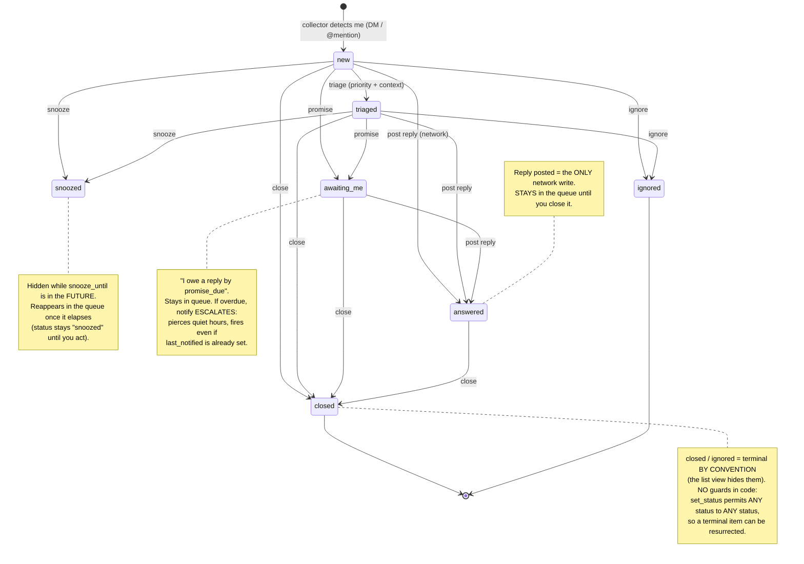

# Chat Triage — Item Lifecycle (the "triage logic")

> What happens to a message **after** the cron collector drops it into the queue.
> The collector only *creates* items as `new`; the triage logic is everything that
> moves an item through its statuses until it is resolved.
>
> Source of truth: `scripts/store.py` (state layer), `scripts/triage_session.py`
> (lifecycle driver), `scripts/triage_cli.py` (operator surface),
> `scripts/notify.py` (escalation). Verified 2026-06-07.

## State machine

## The seven statuses

| Status | Meaning | In queue? | How you get there |
|--------|---------|-----------|-------------------|
| `new` | Just collected, untouched | yes | collector (DM or @mention of me) |
| `triaged` | Priority + context assigned (no network) | yes | `triage <id> --priority high\|normal\|low` |
| `snoozed` | Postponed until a time | hidden until `snooze_until` elapses, then visible | `snooze <id> --until <ISO\|+Nh\|+Nd>` |
| `awaiting_me` | I promised a reply by a due time | yes | `promise <id> --text .. --due ..` |
| `answered` | A reply was posted | **yes — stays open until closed** | `post <id> --text-file ..` (the only network write) |
| `closed` | Done, resolved | no (terminal) | `close <id>` |
| `ignored` | Not relevant | no (terminal) | `ignore <id>` |

`OPEN_STATUSES = {new, triaged, awaiting_me, snoozed, answered}`. `closed` / `ignored`
are excluded from the queue.

## Key properties (verified, not assumed)

1. **`answered` stays in the queue until you explicitly `close` it.** Replying does
   not remove the thread — you keep an eye on replied-but-open conversations and
   close them deliberately.
2. **No transition guards.** `store.set_status` validates only that the *target*
   status string is one of the seven; it does **not** enforce a transition graph.
   Any status -> any status is allowed (e.g. `closed` -> `triaged`). Terminal is a
   convention enforced by the *list view* hiding `closed`/`ignored`, not by the
   mutation layer. Practical effect: you can resurrect a closed item; correctness
   relies on the operator/UI, not on the store rejecting it.
3. **`post` is the only network write in the triage CLI.** It sends the reply
   (threaded by `thread_name`), and only on success records the item as `answered`
   (`response_posted` = real `spaces/.../messages/..`, `answered_at` set). On an API
   error it records **nothing** (no false "answered").
4. **The confirmation gate is in the `/chat-triage` skill, not the raw CLI.** The
   skill asks `Post this to <dest>? (yes / edit / skip / snooze / close / ignore)`
   and only runs `post` on an explicit "yes". Declining never calls `post`, so it
   structurally cannot send or mark answered.
5. **Overdue-promise escalation is a safety net** (`notify.py`): an `awaiting_me`
   item whose `promise_due` is in the past escalates **even inside quiet hours** and
   **even if `last_notified` is already set**. It stops re-escalating once
   `promise_escalated_at` is stamped.

## Queue ordering (`triage_session.triage_queue`)

1. **Overdue promises first** (promise_due in the past).
2. then by **attention tier**: `direct_dm` < VIP sender < urgency-keyword in text <
   `user_mention` < `broadcast` < everything else (lower = more urgent).
3. then **oldest created first**.

A `snoozed` item with `snooze_until` still in the future is omitted entirely.

## History & fields

- Every status transition appends a `{ts, event: "status:<x>"}` entry to the item's
  `history`.
- The collector's `upsert` refreshes `text` only and **never** touches `status` or
  `history` (so a re-collect cannot corrupt an in-progress lifecycle).
- Notifier bookkeeping (`last_notified`, `promise_escalated_at`) is written via
  `set_fields` — **no status change, no history entry**.

---

## What "Phase C" tests (the phase we stopped at)

The testing campaign drives this state machine to prove it behaves correctly:

- **Phase A** — drove the full machine on a **copy** of the store (all transitions
  + queue semantics + a dry-run escalation). PASSED.
- **Phase B** — one **live** post to the user's **own** Inbox space
  (`spaces/AAQAH7kLhwc`, zero blast radius) -> `answered`, verified visible in Chat;
  plus the `/chat-triage` confirmation-gate hold. PASSED.
- **Phase C** — the transitions (`snooze` / `promise` / `close` / `ignore`) on
  **real** low-stakes items **+** notifier escalation of a real overdue promise.
  Already verified on a **copy**; the remaining step is applying a chosen few to the
  **live** backlog (87 `new` items) and confirming each one:
  1. the transition lands on the real store,
  2. the queue reflects it (snoozed disappears, closed/ignored gone, overdue jumps
     to the top),
  3. an overdue promise escalates through `notify`.

Live Phase C mutates the real queue, so it requires explicit go and a cron pause
during the writes (to avoid a save race with the `*/5` collector). `snooze` /
`promise` are reversible; `close` / `ignore` are terminal (item leaves the queue).
